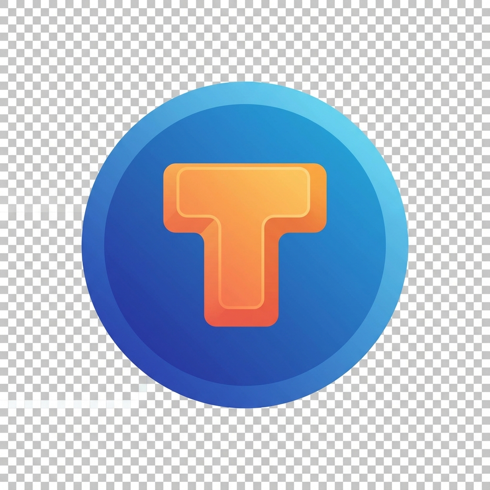

<div align="center">
  
  <h1>TypingPro</h1>
  <p><strong>The Scientific, Ultra-Responsive Typing Master Platform.</strong></p>

  <p>
    <a href="https://github.com/DeepEyeCrypto/TypingPro/releases">
      
    </a>
    <a href="https://github.com/DeepEyeCrypto/TypingPro/actions">
      
    </a>
    <a href="https://react.dev/">
      
    </a>
    <a href="https://github.com/DeepEyeCrypto/TypingPro/blob/main/LICENSE">
      
    </a>
  </p>

  <p>
    <a href="#scientific-curriculum">Curriculum</a> •
    <a href="#liquid-glass-ui">Aesthetics</a> •
    <a href="#downloads">Downloads</a> •
    <a href="#development">Development</a>
  </p>
</div>

---

**TypingPro** is a world-class typing tutor application engineered for absolute beginners and elite typists alike. Built on the **Rust-powered Tauri 2.0** framework and **React 19**, it achieves sub-5ms keystroke latency and cinematic 120FPS rendering.

With a **Scientific curriculum** designed to take you from 0 to 200 WPM, TypingPro removes all mandatory login barriers, allowing you to start mastering the keyboard in seconds.

## 🎓 Scientific Curriculum

Stage-based progression designed by speed-typing experts:

- **Stages 1-2**: Home Row Mastery & Alpha Expansion.
- **Stages 3-5**: Numbers, Symbols, and Flow State.
- **Stages 6-8**: Muscle Memory & Elite Speed Training.
- **150+ Lessons**: Hand-crafted sequences to optimize finger travel and cognitive load.

## 💎 Liquid Glass UI

Inspired by the **iOS 26 Visual Language**:

- **Refractive Surfaces**: Deep glassmorphism with real-time blur and depth effects.
- **Animated Orbs**: Floating liquid background elements for a premium desktop feel.
- **Distraction-Free**: Ultra-clean interface that lets you focus purely on the text.
- **Interactive Helpers**: Real-time `FingerGuide` and `ProgressTracker` for visual feedback.

## 🚀 Key Features

- **Guest-First Architecture**: Start typing immediately; login only to sync progress across devices.
- **Cloud Sync**: Optional Firebase integration for seamless cross-platform tracking.
- **Ultra-Low Latency**: High-performance Rust backend handles every keystroke with precision.
- **Cross-Platform**: Native installers for macOS (Universal), Windows (NSIS), and Linux (DEB).

## 📥 Downloads

Get the latest stable release from the [GitHub Releases](https://github.com/DeepEyeCrypto/TypingPro/releases).

| Platform    | Installer | Architecture                |
| ----------- | --------- | --------------------------- |
| **macOS**   | `.dmg`    | Universal (Silicon & Intel) |
| **Windows** | `.exe`    | x64 (NSIS)                  |
| **Linux**   | `.deb`    | x64                         |

## 🛠 Technology Stack

- **Core Engine**: Rust (Tauri 2.0)
- **Frontend**: React 19, TypeScript, Vite
- **Storage**: LocalStorage (Guest), Firebase (Cloud Sync)
- **Styling**: Vanilla CSS with Liquid Glass Tokens
- **CI/CD**: GitHub Actions Multi-Platform Pipeline

## 💻 Development

1. **Clone & Install**:

   ```bash
   git clone https://github.com/DeepEyeCrypto/TypingPro.git
   npm install
   ```

2. **Run Dev Environment**:

   ```bash
   npm run tauri dev
   ```

3. **Build for Release**:

   ```bash
   npm run ship
   ```

## 📄 License

MIT License. Built with ❤️ for the typing community.

---

<div align="center">
  <sub>Elite Performance. Scientific Mastery. **TypingPro.**</sub>
</div>
